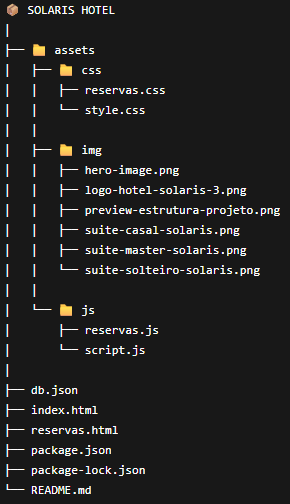

# 🏨 Solaris Hotel

Projeto de site de um hotel fictício, desenvolvido com foco em design moderno, responsividade e organização de código com integração de API simulada usando JSON Server.

---

## 📌 Sobre o projeto

O **Solaris Hotel** é uma landing page que apresenta:

- Destaque principal
- Benefícios do hotel
- Tipos de quartos
- Formulário de reserva funcional
- Layout elegante e responsivo
- Integração com API simulada (JSON Server)

O objetivo foi aplicar conceitos de **HTML, CSS, JS, Bootstrap e JSON Server** evoluindo o projeto com consumo e manipulação de dados via API.

---

## 🚀 Tecnologias utilizadas

- HTML5  
- CSS3  
- Bootstrap 5
- JavaScript
- JSON Server (API fake REST)

---

## 🎨 Layout

O design foi inspirado em sites modernos de hotelaria, com foco em:

- Tipografia elegante (Cormorant + Manrope)
- Paleta de cores sofisticada
- Uso de sombras e bordas suaves
- Boa hierarquia visual

---

## ⚙️ Funcionalidades

- Cadastro de reservas via formulário
- Envio de dados para API simulada (JSON Server)
- Listagem/consulta de reservas
- Feedback ao enviar reserva
- Estrutura preparada para expansão futura

---

## 📱 Responsividade

O site se adapta para diferentes tamanhos de tela:

- Desktop  
- Tablet  
- Mobile  

---

## 📂 Estrutura do projeto

---

## 👨‍💻 Autor

Desenvolvido por Daniel Viana Melchichi